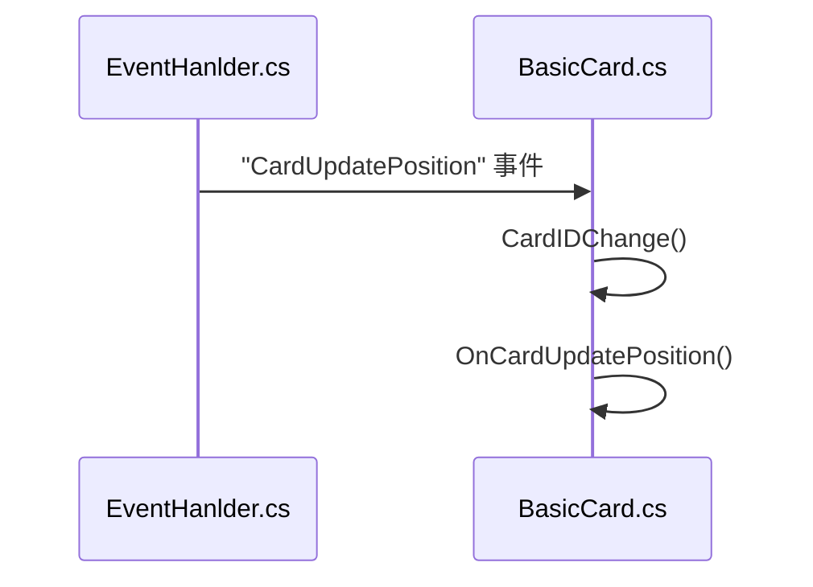
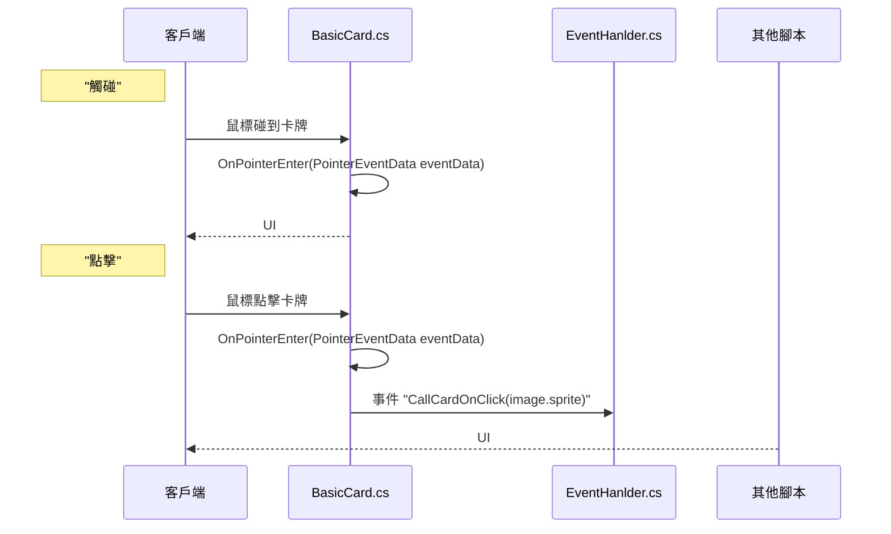

# Unity項目- 卡牌遊戲腳本 "BasicCard.cs"
--- 
[toc]
---
## 流程圖
---
### 大流程

```mermaid
sequenceDiagram
    EventHanlder.cs->>BasicCard.cs: "CardUpdatePosition" 事件 
    BasicCard.cs->>BasicCard.cs: CardIDChange()
    BasicCard.cs->>BasicCard.cs: OnCardUpdatePosition()
    
```

```mermaid
sequenceDiagram
    Note left of 客戶端: "觸碰"
    客戶端->>BasicCard.cs: 鼠標碰到卡牌
    BasicCard.cs->>BasicCard.cs: OnPointerEnter(PointerEventData eventData)
    BasicCard.cs-->>客戶端: UI
    Note left of 客戶端: "點擊"
    客戶端->>BasicCard.cs: 鼠標點擊卡牌
    BasicCard.cs->>BasicCard.cs: OnPointerEnter(PointerEventData eventData)
    BasicCard.cs->>EventHanlder.cs: 事件 "CallCardOnClick(image.sprite)"
    其他腳本-->>客戶端: UI
```

### 小流程