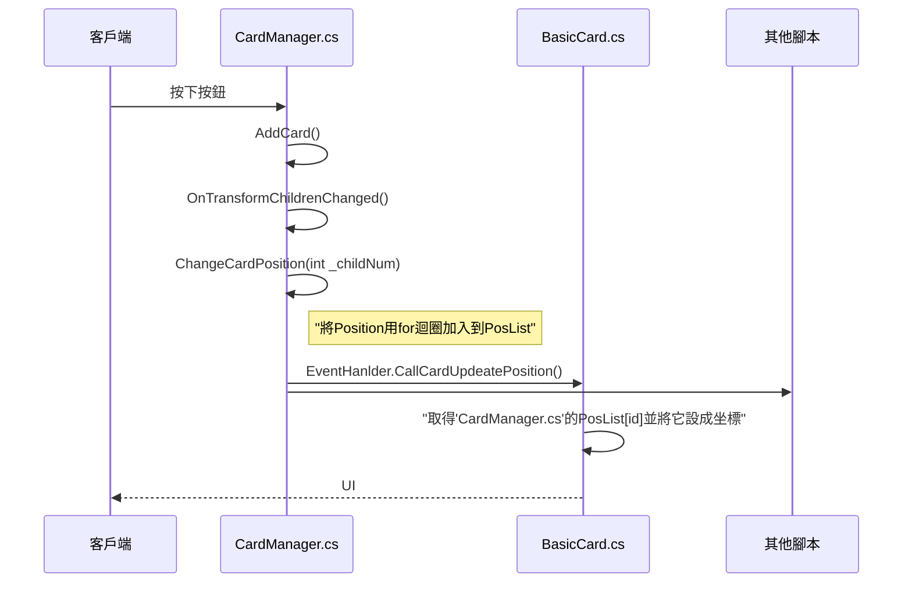
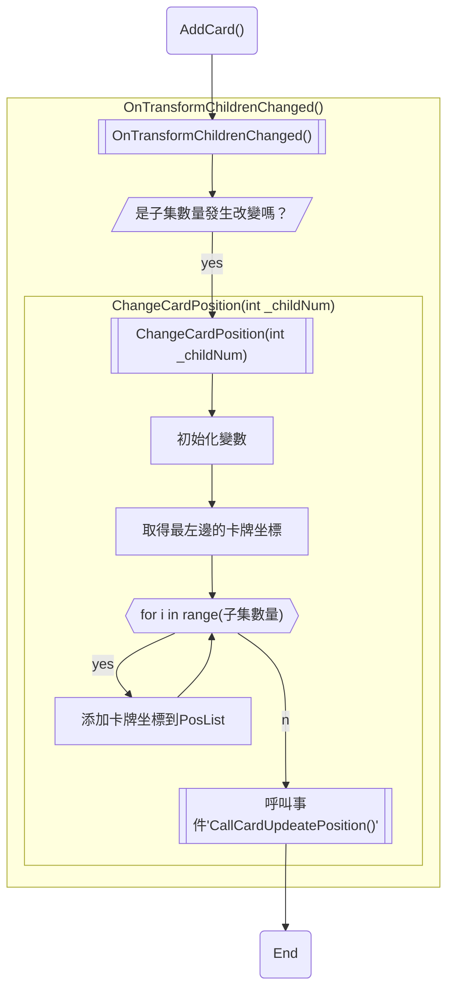

# Unity項目- 卡牌遊戲腳本 "CardManager.cs"
---
[toc]

---
## 流程圖

### 大流程


### 腳本流程

---
## 程式
```csharp
using System.Collections;
using System.Collections.Generic;
using UnityEngine;
using UnityEngine.UI;
using DG.Tweening;

public class CardManager : MonoBehaviour
{
    public List<Vector2> CardPositionList = new List<Vector2>();
    public List<GameObject> CardPrefabList = new List<GameObject>();
    public GameObject cardPrefabs;
    public GameObject cardInstPoint;
    private float cardMoveX;

    [Header("Card Move Setting")]
    public float cardWidth;
    public float moveX;  

    [Header("Card Soft Setting")]
    public int maxCardNum = 5;


    public void AddCard()
    {
        Instantiate(CardPrefabList[Random.Range(0, CardPrefabList.Count)], cardInstPoint.transform.position, Quaternion.identity, this.transform);
    }  

    private void OnTransformChildrenChanged()
    {
        // If Children Change (add or remove)
        if(CardPositionList.Count != transform.childCount)
            ChangeCardPosition(transform.childCount);
    }
  
  
    public void ChangeCardPosition(int _childNum)
    {   
        // Init
        CardPositionList.Clear();

        cardMoveX = cardWidth + moveX;

        if(_childNum > maxCardNum)
        {
            cardMoveX = cardMoveX / (1f + (_childNum - maxCardNum) / (maxCardNum -1));
        }

        // If children count is even number, 
        // the card needs to move some right to keep cards is on center
        int odd = 1;
        odd = (_childNum % 2 == 0)? 1 : 0;

        // the xPos of the leftest card
        float leftX = -(cardMoveX * (int)(_childNum / 2)) + cardMoveX / 2 * odd;
             

        for (int i = 0; i < _childNum; i++)
        {
            // Add Position to List
            CardPositionList.Add(new Vector2(transform.position.x + leftX + cardMoveX * i, transform.position.y));
        }

        EventHanlder.CallCardUpdeatePosition();
    }

}

```
