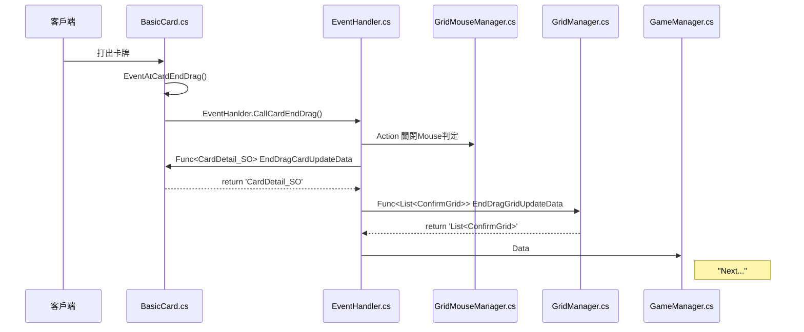

# Unity卡牌系統項目-出卡

[toc]
---
## 流程圖

### 大流程

 

---
## 程式

### BasicCard.cs
```c#
sing System.Collections;
using System.Collections.Generic;
using UnityEngine;
using UnityEngine.UI;
using UnityEngine.EventSystems;
using DG.Tweening;
using System;

public class BasicCard : MonoBehaviour, IPointerEnterHandler, IPointerExitHandler, IBeginDragHandler, IDragHandler, IEndDragHandler, IPointerClickHandler
{
    //..... 省略
    private void OnEnable()
    {      
        EventHanlder.CardUpdatePosition += OnCardUpdatePosition;
        EventHanlder.EndDragCardUpdateData += OnEndDragCardUpdateData;      
    }
    private void OnDisable()
    {
        EventHanlder.CardUpdatePosition -= OnCardUpdatePosition;
        EventHanlder.EndDragCardUpdateData -= OnEndDragCardUpdateData;
    }
    
    
    
    public void OnEndDrag(PointerEventData eventData)
    {
        if(transform.parent != originParent) return; // Card is Paying
        
        EventAtCardEndDrag(eventData);
    }
    
    
    public void EventAtCardEndDrag(PointerEventData eventData)
    {
        // Canel play the card
        if (eventData.position.y < targetCardYPos)
        {
            transform.DOScale(scale * 1f, 0.3f);
            OnCardUpdatePosition();
            image.raycastPadding = halfPadding;
        }
        else
        {
            var lastPos = transform.position; // Let card Position not be different after change parent
            transform.parent = null;
            transform.position = lastPos;

            // Is play card to attack, OR want pay card to let other card attack
            if (GameManager.instance.isPayCard)
            {
                EventHanlder.CallPayTheCard(gameObject);// 未來
            }
            else
            {
                EventHanlder.CallCardEndDrag();
            }
        }
        isDrag = false;

}
```

### EventHandler.cs
```csharp
using System;
using System.Collections;
using System.Collections.Generic;
using UnityEngine;
using UnityEngine.UI;

public static class EventHanlder
{
    //...省略
    // End Drag
    public static event Action CardEndDrag;
    public static Func<CardDetail_SO> EndDragCardUpdateData;

    public static Func<List<ConfirmGrid>> EndDragGridUpdateData;
    public static event Action<ConfirmAreaGridData> EndDragCofirmData; //TODO: GameManager: EndDragCofirmData

    public static void CallCardEndDrag()
    {
        CardEndDrag?.Invoke();

        // cardDetail: "BasicCard" will sent CardDetail_SO
        // ConfirmGridsList: "GridManager" confirm the grid of mouse choose 
        // Then sent data to "GameManager" to check data
        ConfirmAreaGridData data = new ConfirmAreaGridData();

        data.cardDetail = EndDragCardUpdateData?.Invoke();
        data.ConfirmGridsList = EndDragGridUpdateData?.Invoke();


        EndDragCofirmData?.Invoke(data);
    }
}
```

### GridMouseManager.cs
```csharp
using System;
using System.Collections;
using System.Collections.Generic;
using UnityEngine;
using UnityEngine.EventSystems;

public class GridMousePointer : MonoBehaviour
{
    //…省略
    private void OnEnable()
    {
        EventHanlder.CardEndDrag += OnCardEndDrag;      
    }
    private void OnDisable()
    {
        EventHanlder.CardEndDrag -= OnCardEndDrag;
    }
    
    
    private void OnCardEndDrag()
    {
        isCofirmArea = false;
    }
}
```

### GridManager.cs
```csharp
    using System;
using System.Collections;
using System.Collections.Generic;
using UnityEngine;

public class GridManager : MonoBehaviour
{
    public List<GameObject> GridsList;
    public List<ConfirmAreaGridData> isConfirmGridsList;

    private void Awake() 
    {
        for (int i = 0; i < transform.childCount; i++)
        {
            GridsList.Add(transform.GetChild(i).gameObject);
        }
    }
    private void OnEnable()
    {
        EventHanlder.EndDragGridUpdateData += UpdateData;
    }

    private void OnDisable()
    {
        EventHanlder.EndDragGridUpdateData -= UpdateData;
    }

    private List<ConfirmGrid> UpdateData()
    {
        List<ConfirmGrid> dataList = new List<ConfirmGrid>();

        // Find object which "isMouseOnArea" is true to return data 
        foreach (var grid in GridsList)
        {
            // Get grid object script
            Grid gridCS = grid.GetComponent<Grid>();

            //isMouseOnArea
            if(gridCS.isMouseOnArea)
            {
                //ConfirmAreaGridData
                // |- ...
                // |- ConfirmGrid
                //          |- gridX, gridY  => can get form script

                dataList.Add(gridCS.gridID);
            }
        }

        return dataList;
    }
}
```
