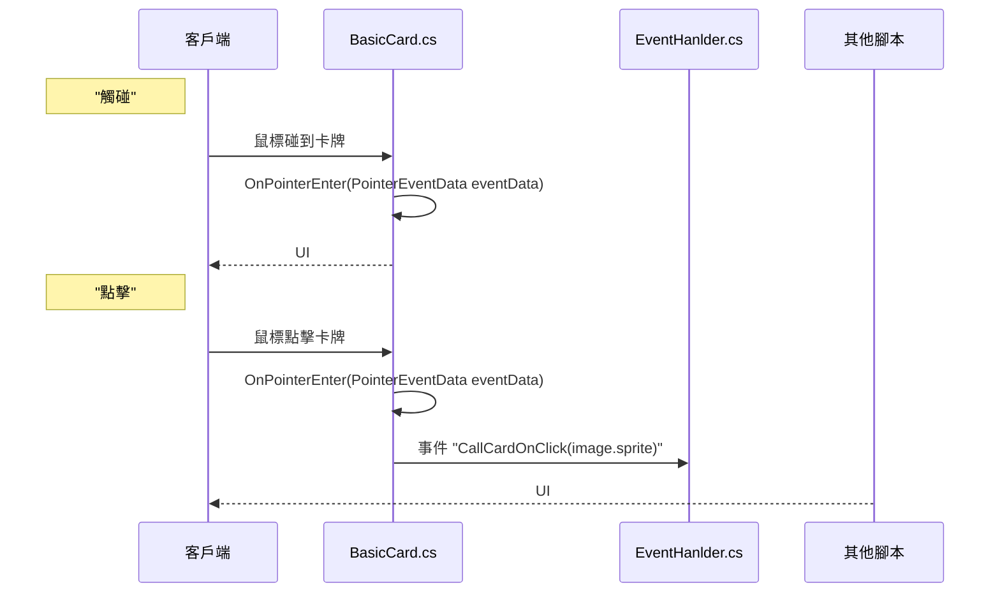

# Unity卡牌系統項目-出卡

[toc]
---
## 流程圖

### 大流程

 
```mermaid
sequenceDiagram
    
    

```

```mermaid
sequenceDiagram
    Note left of 客戶端: "觸碰"
    客戶端->>BasicCard.cs: 鼠標碰到卡牌
    BasicCard.cs->>BasicCard.cs: OnPointerEnter(PointerEventData eventData)
    BasicCard.cs-->>客戶端: UI
    Note left of 客戶端: "點擊"
    客戶端->>BasicCard.cs: 鼠標點擊卡牌
    BasicCard.cs->>BasicCard.cs: OnPointerEnter(PointerEventData eventData)
    BasicCard.cs->>EventHanlder.cs: 事件 "CallCardOnClick(image.sprite)"
    其他腳本-->>客戶端: UI
```

### 小流程