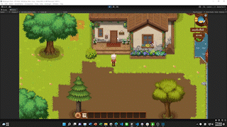
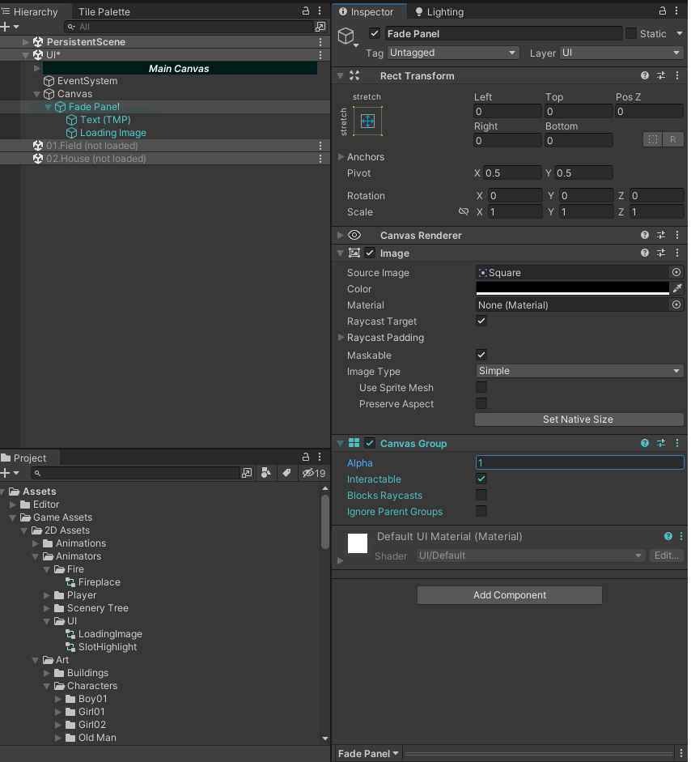

# **Unity - Fade In Out 動畫**

---




[toc]


## 製作 Loading UI

**需要有 Canvas, Panel (必須要有 *'Canvas Group*' 組件)**


## 新增腳本並編寫

新增腳本 *TransitionManager.cs*

**TransitionManager.cs**

```c#
using System.Collections;
using System.Collections.Generic;
using UnityEngine;
using UnityEngine.SceneManagement;


public class TransitionManager : MonoBehaviour
{
    private CanvasGroup FadeCanvasGroup;
    private bool isFade;
    
    public float fadeDuration = 1.5f;

    private void Start()
    {
        StartCoroutine(LoadSceneSetActive(startSceneName));

        FadeCanvasGroup = FindObjectOfType<CanvasGroup>();
    }

    /// <summary>
    /// Scene FadeIn FadeOut
    /// </summary>
    /// <param name="targetAlpha">1 is Black, 0 is transparent</param>
    /// <returns></returns>
    private IEnumerator Fade(float targetAlpha)
    {
        isFade = true;

        FadeCanvasGroup.blocksRaycasts = true;

        float speed = Mathf.Abs(FadeCanvasGroup.alpha - targetAlpha) / fadeDuration;

        while (!Mathf.Approximately(FadeCanvasGroup.alpha, targetAlpha))
        {
            FadeCanvasGroup.alpha = Mathf.MoveTowards(FadeCanvasGroup.alpha, targetAlpha, speed * Time.deltaTime);
            yield return null;
        }

        FadeCanvasGroup.blocksRaycasts = false;

        isFade = false;
    }
    //記得在你需要特效的地方添加 Fade協程
}

```


> 記得在你需要特效的地方添加**Fade協程**


