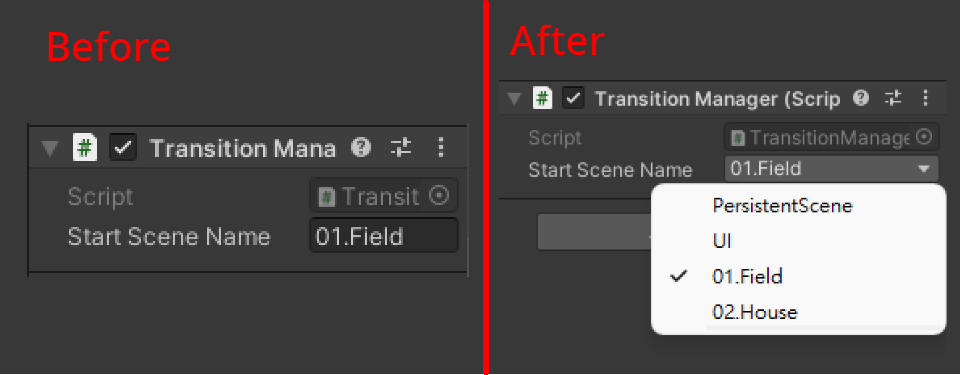

# **Unity - [Scene Name] Attribute 特性**

---





[toc]


## 新增兩個腳本


+ Attribute
	+ SceneNameAttribute.cs
	+ SceneNameDrawer.cs


## 編寫腳本

---

**SceneNameAttribute.cs**

```c#
using System.Collections.Generic;
using UnityEngine;

public class SceneNameAttribute : PropertyAttribute
{
    public string[] NameList { get => AllSceneNames(); }
    public static string[] AllSceneNames()
    {
        var temp = new List<string>();
        foreach (UnityEditor.EditorBuildSettingsScene S in UnityEditor.EditorBuildSettings.scenes)
        {
            if (S.enabled)
            {
                string name = S.path.Substring(S.path.LastIndexOf('/') + 1);
                name = name.Substring(0, name.Length - 6);
                temp.Add(name);
            }
        }
        return temp.ToArray();
    }
}
```


**SceneNameDrawer.cs**

```c#
using System;
using UnityEditor;
using UnityEngine;

#if UNITY_EDITOR
[CustomPropertyDrawer(typeof(SceneNameAttribute))]
public class SceneNameDrawer : PropertyDrawer
{
    public override void OnGUI(Rect position, SerializedProperty property, GUIContent label)
    {
        var sceneName = attribute as SceneNameAttribute;
        var list = sceneName.NameList;

        if (property.propertyType == SerializedPropertyType.String)
        {
            int index = Mathf.Max(0, Array.IndexOf(list, property.stringValue));
            index = EditorGUI.Popup(position, property.displayName, index, list);

            property.stringValue = list[index];
        }
        else if (property.propertyType == SerializedPropertyType.Integer)
        {
            property.intValue = EditorGUI.Popup(position, property.displayName, property.intValue, list);
        }
        else
        {
            base.OnGUI(position, property, label);
        }
    }
}
#endif
```

